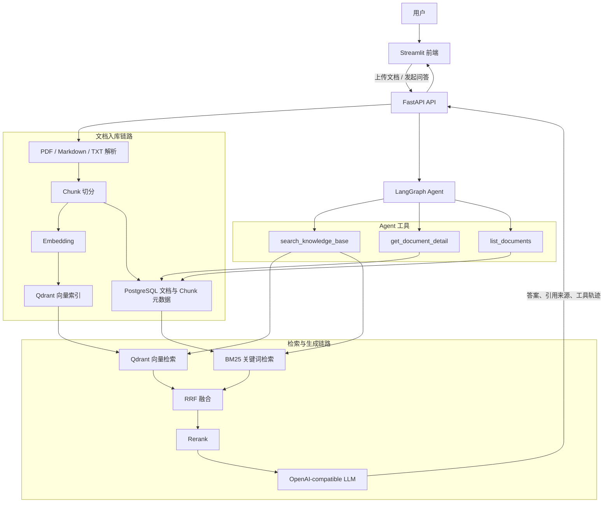

# 企业知识库 RAG Agent 系统

基于 LangGraph 的企业级 RAG 问答系统，支持多文档管理、Hybrid Search、Rerank 和 Agent 工具调用。

## 项目状态文档

- [完整交接包](HANDOFF.md)
- [当前状态](STATUS.md)
- [技术决策](DECISIONS.md)
- [后续任务](TODO.md)
- [架构说明](docs/architecture.md)

## 技术栈

| 层级 | 技术 |
|------|------|
| 后端框架 | Python 3.11 · FastAPI · Uvicorn |
| Agent 编排 | LangGraph |
| 向量数据库 | Qdrant |
| 关系数据库 | PostgreSQL |
| 检索增强 | Hybrid Search (向量 + BM25) · Rerank |
| 前端 | Streamlit |
| 部署 | Docker · Docker Compose |

## 架构图



问答链路：用户问题 → Agent 选择工具 → Hybrid Search → Rerank → LLM 生成带引用答案。

入库链路：上传文件 → 文本解析 → Chunk 切分 → 生成 Embedding → 写入 Qdrant 与 PostgreSQL。

## 核心功能

- **文档管理**：支持上传 PDF / Markdown / TXT，自动解析入库
- **Hybrid Search**：向量检索 + BM25 关键词检索，RRF 融合排序
- **Rerank**：对 top-20 结果重排，输出 top-5，提升精准度
- **RAG 问答**：基于检索结果生成答案，带来源引用
- **LangGraph Agent**：根据问题类型自主选择工具，支持多轮对话
- **评测系统**：50 条 QA 数据集，自动评测 source_hit rate 和答案质量

## 效果评测

> TODO: 填写评测结果

| 指标 | 数值 |
|------|------|
| Source Hit Rate | - |
| 平均延迟 | - |
| 评测集大小 | 50 条 |

## 快速启动

> 当前处于项目初始化阶段，以下命令将在 Docker Compose 完成后可用。

```bash
# 复制环境变量
cp .env.example .env
# 编辑 .env 填入 API Key

# 一键启动
docker-compose up -d
```

访问 `http://localhost:8501` 打开前端页面。

## 本地开发

所有命令均从仓库根目录执行：

```powershell
python -m venv .venv
.\.venv\Scripts\python.exe -m pip install -r backend/requirements.txt
Copy-Item .env.example .env
# 编辑 .env，只把真实 DeepSeek Key 写入 LLM_API_KEY
.\.venv\Scripts\python.exe -m uvicorn backend.app.main:app --reload
```

启动后访问 `http://127.0.0.1:8000/docs` 查看接口文档，运行测试：

```powershell
.\.venv\Scripts\python.exe -m pytest backend/tests -v
```

## 当前接口

| 方法与路径 | 输入 | 当前响应 |
|------------|------|----------|
| `GET /health` | 无 | `200 {"status": "ok"}` |
| `POST /chat` | `{"message": "...", "stream": false}` | 完整 JSON 回答 |
| `POST /chat` | `{"message": "...", "stream": true}` | SSE 流式回答，结束标记为 `[DONE]` |
| `POST /documents/upload` | 无 | `501 Not Implemented`，Day 4 实现 |

LLM 使用 OpenAI-compatible 接口。当前默认配置为 `deepseek-v4-flash`，
并通过 `LLM_EXTRA_BODY` 关闭思考模式；真实 `LLM_API_KEY` 只写入本地 `.env`。

## TODO

- [x] 项目初始化，目录结构
- [x] FastAPI 后端骨架
- [x] 接入 LLM API（流式输出）
- [ ] 文档上传与解析（PDF / MD / TXT）
- [ ] 文本切分（RecursiveCharacterTextSplitter）
- [ ] Embedding 生成（批量 + 重试）
- [ ] Qdrant 向量存储与检索
- [ ] 基础 RAG 链路（检索 → 生成 → 引用来源）
- [ ] 检索优化（top_k · metadata filter · chunk size 对比）
- [ ] BM25 关键词检索
- [ ] Hybrid Search（RRF 融合）
- [ ] Rerank（cross-encoder 或 API）
- [ ] LangGraph Agent 编排
- [ ] Agent 工具调用（search / detail / list）
- [ ] 多轮对话记忆
- [ ] 评测数据集（50 条 QA）
- [ ] 评测脚本（LLM-as-judge）
- [ ] 请求日志与可观测性
- [ ] Streamlit 前端
- [ ] Docker Compose 一键部署
- [ ] README 完善 + 简历话术

## 开发日志

见 [PLAN.md](PLAN.md)
