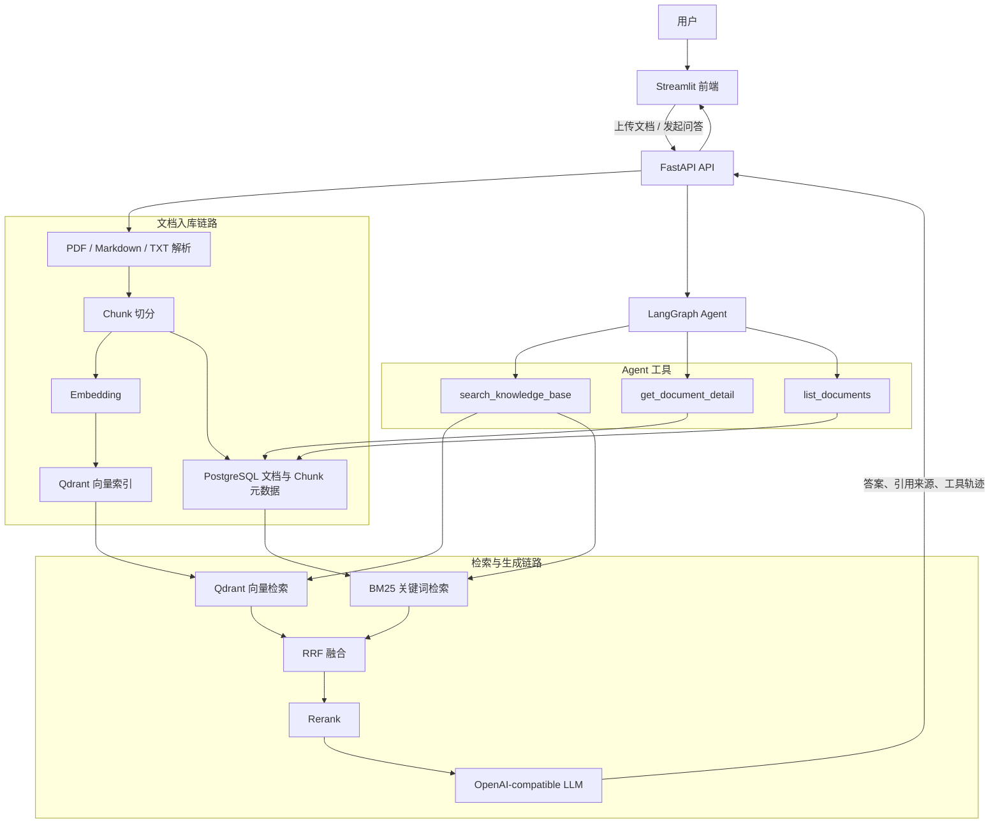

# 企业知识库 RAG Agent 系统

企业级 RAG 问答系统项目。Day 1 至 Day 8 已提交；当前工作区已实现 Day 9 检索优化：
`POST /retrieval/search` 支持严格校验的 `top_k`（1～20，默认 5）和单文档 `doc_id`
过滤（在 Qdrant 查询内生效），每次成功检索输出一条不含正文的单行 JSON 日志，并完成
300/500/800 chunk size 的真实检索质量对比。Day 9 尚未提交，`PLAN.md` 本轮未修改。
Day 8 `/chat` 契约（固定 Top 5 + 0.46 门控）保持不变。BM25、Hybrid Search、Rerank、
LangGraph Agent 等仍属于后续目标。

## 项目状态文档

- [完整交接包](HANDOFF.md)
- [当前状态](STATUS.md)
- [技术决策](DECISIONS.md)
- [后续任务](TODO.md)
- [架构说明](docs/architecture.md)
- [Day 8 RAG 验收记录](docs/day8-rag-smoke.md)
- [Day 9 检索优化实验](docs/day9-retrieval-tuning.md)

## 技术栈

| 层级 | 技术 |
|------|------|
| 后端框架 | Python 3.11 · FastAPI · Uvicorn |
| Agent 编排 | LangGraph |
| 向量数据库 | Qdrant |
| 关系数据库 | PostgreSQL · SQLAlchemy 2.x · psycopg 3 |
| 文本向量 | SentenceTransformers · BAAI/bge-small-zh-v1.5 · CPU |
| 检索增强 | Hybrid Search (向量 + BM25) · Rerank |
| 前端 | Streamlit |
| 部署 | Docker · Docker Compose |

## 架构图

以下是最终目标架构；当前实现进度以“当前接口”和 TODO 为准。



问答链路：用户问题 → Agent 选择工具 → Hybrid Search → Rerank → LLM 生成带引用答案。

入库链路：上传文件 → 文本解析 → Chunk 切分 → 生成 Embedding → 写入 Qdrant 与 PostgreSQL。

## 目标功能

- **文档管理**：支持上传 PDF / Markdown / TXT，自动解析入库
- **Hybrid Search**：向量检索 + BM25 关键词检索，RRF 融合排序
- **Rerank**：对 top-20 结果重排，输出 top-5，提升精准度
- **RAG 问答**：基于检索结果生成答案，带来源引用
- **LangGraph Agent**：根据问题类型自主选择工具，支持多轮对话
- **评测系统**：50 条 QA 数据集，自动评测 source_hit rate 和答案质量

## 效果评测

> TODO: 填写评测结果

Day 5 已完成 300/500/800 token 的结构性对比，结果见
[Chunk Size 结构对比](docs/day5-chunk-size-comparison.md)。该实验不包含检索质量结论。
Day 9 已在真实 BGE + Qdrant 上完成同一组配置的检索质量对比，见上方
「检索优化实验」小节和 [Day 9 检索优化实验](docs/day9-retrieval-tuning.md)。

| 指标 | 数值 |
|------|------|
| Source Hit Rate | - |
| 平均延迟 | - |
| 评测集大小 | 50 条 |

## 快速启动

> 完整的一键启动将在 Day 21 完成。当前只编排 PostgreSQL。

```powershell
Copy-Item .env.example .env
# 编辑 .env，设置 LLM_API_KEY 和本地 PostgreSQL 密码
docker compose up -d postgres
.\.venv\Scripts\python.exe -m backend.app.models.init_db
.\.venv\Scripts\python.exe -m uvicorn backend.app.main:app --reload
```

## 本地开发

所有命令均从仓库根目录执行：

```powershell
python -m venv .venv
.\.venv\Scripts\python.exe -m pip install -r backend/requirements.txt
Copy-Item .env.example .env
# 编辑 .env，只把真实 DeepSeek Key 写入 LLM_API_KEY
.\.venv\Scripts\python.exe -m uvicorn backend.app.main:app --reload
```

启动后访问 `http://127.0.0.1:8000/docs` 查看接口文档，运行测试：

```powershell
.\.venv\Scripts\python.exe -m pytest backend/tests -v
```

## 本地 Embedding 验证

Day 6 使用固定 revision 的 `BAAI/bge-small-zh-v1.5`，不需要 OpenAI API Key，
也不会使用 DeepSeek Key。默认在 CPU 上每批最多处理 32 个 Chunk，输出 512 维归一化
向量。文档 Chunk 会直接编码，不添加查询指令。

首次运行会把模型下载到被 Git 忽略的 `data/models/`。使用已有 Document UUID 执行：

```powershell
.\.venv\Scripts\python.exe -m backend.app.commands.embed_document --document-id <UUID>
```

命令按 `chunk_index` 读取 PostgreSQL 中的 Chunk，在推理前使用 BGE tokenizer 检查
512 token 上限，并只打印模型、revision、Chunk 数量、维度和状态。它不会打印正文或完整
向量，也不会写回 PostgreSQL 或 Qdrant。真实模型测试默认跳过，可显式执行：

```powershell
$env:RUN_LOCAL_EMBEDDING_INTEGRATION='1'
.\.venv\Scripts\python.exe -m pytest backend/tests/test_embedding_integration.py -v
```

## 本地 Qdrant 索引与检索

Day 7 固定使用 `qdrant/qdrant:v1.18.1` 和 `qdrant-client==1.18.0`。Qdrant 仅绑定
本机 REST 端口 6333，并使用命名卷持久化：

```powershell
docker pull qdrant/qdrant:v1.18.1
docker volume create rag-agent-qdrant-data
docker run -d --name rag-agent-qdrant `
  -p 127.0.0.1:6333:6333 `
  -v rag-agent-qdrant-data:/qdrant/storage `
  qdrant/qdrant:v1.18.1
```

显式初始化 collection，并索引一个已有 PostgreSQL Document：

```powershell
.\.venv\Scripts\python.exe -m backend.app.commands.init_qdrant
.\.venv\Scripts\python.exe -m backend.app.commands.index_document --document-id <UUID>
```

Collection 使用 unnamed 512 维 Cosine 向量；Point ID 等于 Chunk UUID。索引命令在关闭
PostgreSQL Session 后才执行模型推理和 Qdrant upsert，每批最多 32 条并使用 `wait=True`。
重复运行依靠稳定 UUID 幂等覆盖。真实 Qdrant 测试需显式开启：

```powershell
$env:RUN_QDRANT_INTEGRATION='1'
.\.venv\Scripts\python.exe -m pytest backend/tests/test_qdrant_integration.py -v
```

## 基础 RAG 问答

Day 8 的 `/chat` 先执行 Day 7 固定 Top 5 检索，再在生成层用 `0.46` 门槛过滤 Context。
该值来自三条知识库内问题和三条知识库外问题的真实 BGE/Qdrant 校准，详细分数与限制见
[Day 8 RAG 验收记录](docs/day8-rag-smoke.md)。门槛不是可调 API 参数，也不是概率。

通过门槛的 Chunk 以 JSON 放入 user message，system message 只保存 RAG 安全规则。无相关
Context 时后端直接返回 `知识库中没有相关信息`，不调用 DeepSeek。普通响应包含
`answer`、`model` 和后端生成的 `sources`；SSE 成功流在 delta 后发送 sources event，
再发送 `[DONE]`。模型自由文本中的文件名/页码来源标记会被清理，客户端只应信任结构化
`sources`。上传后仍必须显式执行 `index_document`，不会自动索引。

## 检索优化实验（Day 9）

使用随测试提交的 8 页确定性、自撰制度语料和 8 个带 `expected_phrase` 的固定问题，在
真实本地 BGE 与真实 Qdrant 上对比三种 chunk 配置。命中只按 NFKC + strip 后的
`expected_phrase` 子串包含关系判定，固定 Top 5：

| 配置 (size/overlap) | Chunk 数 | 平均 Chunk token | Hit@1 | Hit@5 | MRR@5 | Top-5 context token 总量 |
|---|---:|---:|---:|---:|---:|---:|
| 300/60 | 40 | 199.3 | 1.00 | 1.00 | 1.000 | 7986 |
| 500/100 | 24 | 332.9 | 1.00 | 1.00 | 1.000 | 13590 |
| 800/160 | 16 | 499.9 | 1.00 | 1.00 | 1.000 | 18576 |

关键发现：

- 三种配置产生不同 Chunk 数（40 / 24 / 16），全部通过真实 BGE 预检并完成 Qdrant 检索。
- 三种配置在 8 个单页事实问题上均为满分，当前小型语料无法区分检索质量；上下文近似
  成本随 chunk size 增大，Top-5 token 总量为 7986 / 13590 / 18576。
- 语料用固定长审计标识稳定拉开 `o200k_base` 长度；该标识被 BGE tokenizer 压缩为极少
  token。因此最大 BGE token 仅为 62 / 114 / 213。这是刻意的受控实验设计，不代表自然
  长文本能安全使用 800 token Chunk。
- 生产默认保持 `500/100` 不变；本实验语料受控且规模小，不构成"普遍最优"结论。

完整方法、数据与局限性见 [Day 9 检索优化实验](docs/day9-retrieval-tuning.md)。

## 当前接口

| 方法与路径 | 输入 | 当前响应 |
|------------|------|----------|
| `GET /health` | 无 | `200 {"status": "ok"}` |
| `POST /chat` | `{"message": "...", "stream": false}` | RAG JSON：answer、model、sources |
| `POST /chat` | `{"message": "...", "stream": true}` | RAG SSE：delta、sources、`[DONE]` |
| `POST /documents/upload` | `multipart/form-data`，字段 `file` | 成功返回 `201` 文档元数据；支持 PDF / MD / TXT |
| `POST /retrieval/search` | `{"query": "...", "top_k": 8, "doc_id": "UUID"}`（后两项可选） | 返回最多 `top_k` 个 Chunk、来源和 score，不返回向量 |

LLM 使用 OpenAI-compatible 接口。当前默认配置为 `deepseek-v4-flash`，
并通过 `LLM_EXTRA_BODY` 关闭思考模式；真实 `LLM_API_KEY` 只写入本地 `.env`。

文档上传按 1 MiB 分块写入临时文件，实际大小上限为 20 MiB；PDF 最多 500 页。
PDF 按页提取并以 `\f` 保存页边界，Markdown/TXT 使用 UTF-8 并视为第 1 页。
每个非空页面使用 `o200k_base` tokenizer 独立切分，默认上限为 500 token、overlap 为
100 token；空白页不生成 Chunk，后续页面保留原页码。Document 与有序 Chunk 在同一
事务中写入 PostgreSQL，上传成功响应字段保持不变。
数据库表必须通过 `python -m backend.app.models.init_db` 显式创建，应用启动和
`GET /health` 不依赖 PostgreSQL、Qdrant、BGE 或 LLM。搜索 Query 使用 BGE 查询
instruction；文档 Chunk 保持直接编码。检索接口的 `top_k` 使用严格整数校验（拒绝
布尔、字符串和浮点），范围 1～20，默认 5；`doc_id` 过滤在 Qdrant 查询内部执行，
返回结果会再做一次文档一致性防御校验。合法但无匹配的 `doc_id` 返回 200 空数组。
每次成功检索输出一条单行 JSON 日志（query 摘要哈希、top_k、结果名次/Chunk ID/页码/
分数），不记录 query 原文、Chunk 正文、metadata 或向量。score threshold 仍不开放；
RAG 门槛只在服务内部使用，`/chat` 保持固定 Top 5。

## TODO

- [x] 项目初始化，目录结构
- [x] FastAPI 后端骨架
- [x] 接入 LLM API（流式输出）
- [x] 文档上传与解析（PDF / MD / TXT）
- [x] 文本切分（RecursiveCharacterTextSplitter）
- [x] 本地 Embedding 生成（BGE · 批量 · 下载重试 · 不持久化）
- [x] Qdrant 向量存储与检索（显式索引 · 固定 Top 5）
- [x] 基础 RAG 链路（固定 Top 5 → 门控 → 生成 → 结构化来源）
- [x] 检索优化（top_k · doc_id filter · 检索日志 · chunk size 真实对比）
- [ ] BM25 关键词检索
- [ ] Hybrid Search（RRF 融合）
- [ ] Rerank（cross-encoder 或 API）
- [ ] LangGraph Agent 编排
- [ ] Agent 工具调用（search / detail / list）
- [ ] 多轮对话记忆
- [ ] 评测数据集（50 条 QA）
- [ ] 评测脚本（LLM-as-judge）
- [ ] 请求日志与可观测性
- [ ] Streamlit 前端
- [ ] Docker Compose 一键部署
- [ ] README 完善 + 简历话术

## 开发日志

见 [PLAN.md](PLAN.md)
