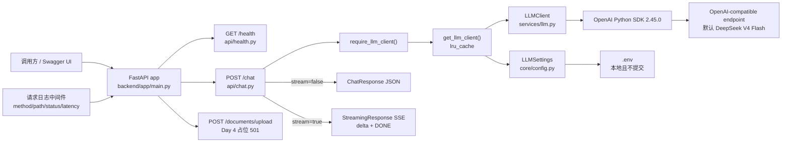
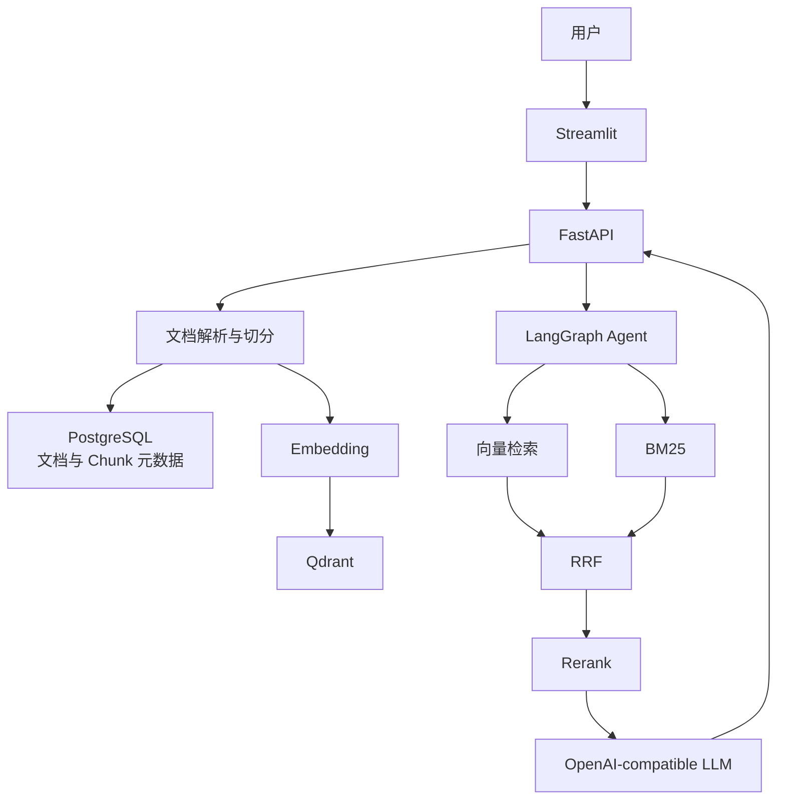

# 架构说明

更新时间：2026-07-15（America/New_York）

本文区分“当前已实现架构”和“最终目标架构”。目标组件不代表已经完成。

## 当前已实现架构（Day 3 未提交状态）

## 当前请求流程

### 非流式 `/chat`

1. `ChatRequest` 验证 `message` 和 `stream=false`；
2. `require_llm_client()` 获取缓存的 `LLMClient`；
3. `LLMClient.complete()` 调用 `chat.completions.create(..., stream=False)`；
4. 返回 `ChatResponse(answer, model)`；
5. 配置缺失返回 `503`，上游 `OpenAIError` 映射为 `502`。

### 流式 `/chat`

1. `ChatRequest` 验证 `stream=true`；
2. `LLMClient.stream()` 调用兼容接口并逐个产生 `delta.content`；
3. `stream_sse()` 编码为 `data: {"delta":"..."}\n\n`；
4. 正常完成输出 `data: [DONE]\n\n`；
5. 流对象在完成、中断或异常时尝试 `close()`；
6. 流中上游错误输出通用 `event: error`，此时 HTTP headers 可能已经是 `200`，这是 SSE 的正常限制。

## 配置边界

应用配置：`Settings`，环境变量前缀 `APP_`。
LLM 配置：`LLMSettings`，环境变量前缀 `LLM_`。

`LLMClient` 不知道供应商名称。DeepSeek 的思考开关通过
`LLM_EXTRA_BODY={"thinking":{"type":"disabled"}}` 作为不透明扩展透传。

## 当前没有实现的组件

以下均属于未来计划，当前不得视为已完成：

- 文件解析和上传存储；
- PostgreSQL 表和数据库连接；
- 文本切分；
- Embedding；
- Qdrant；
- BM25、RRF、Rerank；
- RAG prompt 与引用；
- LangGraph、Agent 工具和记忆；
- 评测、trace、Streamlit、Docker Compose。

## 最终目标架构

## 模块演进规则

- `api/` 只处理 HTTP 输入输出和错误映射；
- `services/` 封装外部服务与业务能力；
- `core/` 负责配置、日志和横切能力；
- `models/` 留给数据库模型；
- `agent/` 留给 Day 13-16 LangGraph；
- 不得为未来组件提前加入未经计划验证的抽象。
