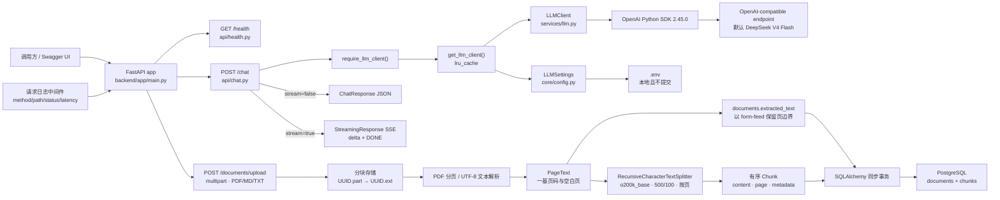
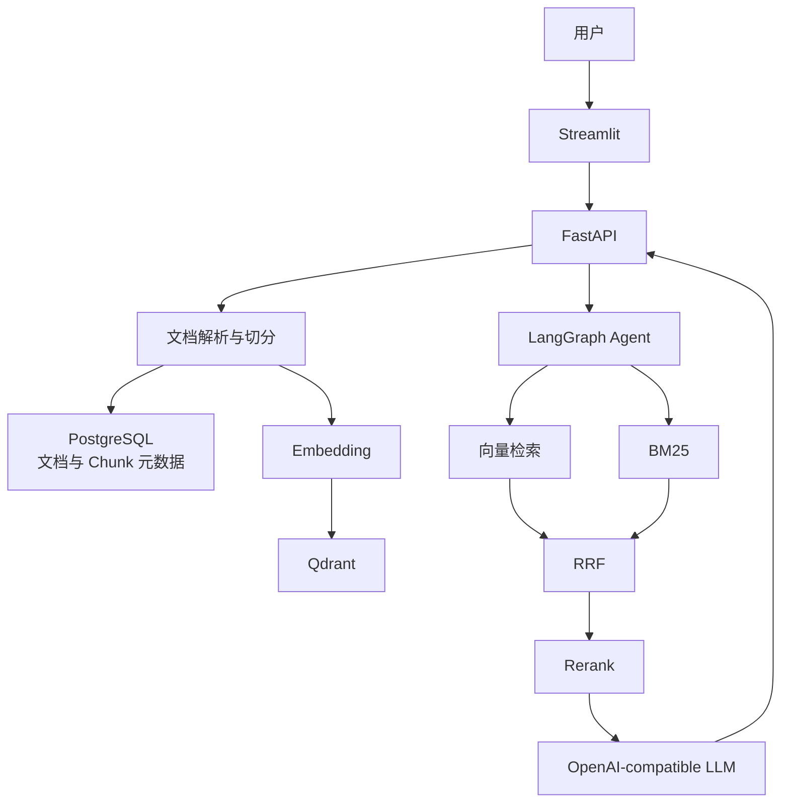

# 架构说明

更新时间：2026-07-15（America/New_York）

本文区分“当前已实现架构”和“最终目标架构”。目标组件不代表已经完成。

## 当前已实现架构（Day 5 已验收，尚未提交）

上图中的上传接口已替换 Day 2 占位实现。Day 5 在不改变 `201` 响应字段的前提下，
为新上传文档生成按页 Chunk。真实分页 PDF、磁盘、PostgreSQL JSONB、顺序和级联删除
验收已经通过；Day 5 当前尚未提交，`PLAN.md` 未修改。

## 当前请求流程

### 非流式 `/chat`

1. `ChatRequest` 验证 `message` 和 `stream=false`；
2. `require_llm_client()` 获取缓存的 `LLMClient`；
3. `LLMClient.complete()` 调用 `chat.completions.create(..., stream=False)`；
4. 返回 `ChatResponse(answer, model)`；
5. 配置缺失返回 `503`，上游 `OpenAIError` 映射为 `502`。

### 流式 `/chat`

1. `ChatRequest` 验证 `stream=true`；
2. `LLMClient.stream()` 调用兼容接口并逐个产生 `delta.content`；
3. `stream_sse()` 编码为 `data: {"delta":"..."}\n\n`；
4. 正常完成输出 `data: [DONE]\n\n`；
5. 流对象在完成、中断或异常时尝试 `close()`；
6. 流中上游错误输出通用 `event: error`，此时 HTTP headers 可能已经是 `200`，这是 SSE 的正常限制。

### 文档上传 `/documents/upload`

1. 同步路由在线程池中读取 `UploadFile.file`，每次最多 1 MiB；
2. 同时验证安全文件名、扩展名、MIME 与可解析内容，实际大小不得超过 20 MiB；
3. 文件先写为服务端 UUID 对应的 `.part`，PDF 最多 500 页；
4. PDF 每页形成一个 `PageText`，空白页保留；所有页均无文本时返回 `400`；
5. `split_pages()` 逐页使用 `o200k_base` 和 `RecursiveCharacterTextSplitter` 切分；
   空白页不生成 Chunk，`chunk_index` 在文档内从 0 连续递增；
6. 页文本以 `\f` 拼接后写入 `documents.extracted_text`，Chunk 写入 `chunks`；
7. 同一事务先 flush Document，再 flush Chunks，随后 `os.replace`，最后提交；
8. 任一异常都会回滚两张表并清理临时文件和已移动文件。移动后进程立即崩溃仍可能留下孤儿文件，属于已知残余风险。

## 配置边界

应用配置：`Settings`，环境变量前缀 `APP_`。
LLM 配置：`LLMSettings`，环境变量前缀 `LLM_`。
PostgreSQL 配置：`DatabaseSettings`，环境变量前缀 `POSTGRES_`。
上传配置：`DocumentSettings`，相对目录从仓库根目录解析，不依赖当前工作目录。
切分配置：`ChunkingSettings`，环境变量为 `CHUNK_SIZE`、`CHUNK_OVERLAP`、
`CHUNK_ENCODING_NAME`，默认 `500`、`100`、`o200k_base`。

`LLMClient` 不知道供应商名称。DeepSeek 的思考开关通过
`LLM_EXTRA_BODY={"thinking":{"type":"disabled"}}` 作为不透明扩展透传。

## 当前没有实现的组件

以下均属于未来计划，当前不得视为已完成：

- Embedding；
- Qdrant；
- BM25、RRF、Rerank；
- RAG prompt 与引用；
- LangGraph、Agent 工具和记忆；
- 评测、trace、Streamlit、Docker Compose。

## 最终目标架构

## 模块演进规则

- `api/` 只处理 HTTP 输入输出和错误映射；
- `services/` 封装外部服务与业务能力；
- `core/` 负责配置、日志和横切能力；
- `models/` 留给数据库模型；
- `agent/` 留给 Day 13-16 LangGraph；
- 不得为未来组件提前加入未经计划验证的抽象。

数据库不会在 FastAPI lifespan 或 `/health` 中初始化。Day 5 继续使用
`python -m backend.app.models.init_db` 显式执行 `Base.metadata.create_all()` 创建缺失的新表；首次需要修改
既有表结构前再引入迁移工具。
